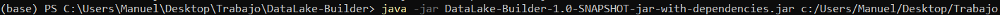
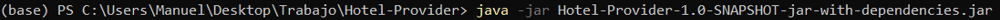
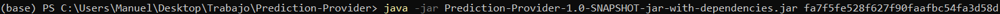
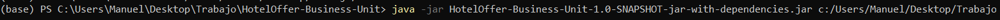
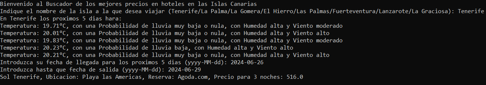

# Proyecto Final: Implementación de Publisher/Subscriber en Java

Manuel Alejandro Torrealba Torrealba

**Asignatura:** Desarrollo de Aplicaciones para Ciencia de Datos

**Curso:** Grado de Ingeniería en Ciencia de Datos

**Escuela:** Facultad de Ingeniería Informatica 

**Universidad:** Universidad de Las Palmas de Gran Canaria

## Instrucciones de Ejecución

Para llevar a cabo la ejecucion del codigo, se debera descargar y descomprimir los modulos DataLake-Builder.zip, Prediction-Provider.zip, Hotel-Provider.zip y HotelOffer-Business-Unit.zip que se encuentran en el release del repositorio. 
Deberia seguir los siguientes pasos:
  1. **Descargar y descomprimir los archivos .zip de los modulos del programa en alguna ubicación de su PC**
  2. **Activar el broker ActiveMQ**
  3. **Ejecutar el modulo DataLake-Builder**
      - Para su ejecución es necesario usar como argumento un path con el directorio donde quiere que se guarden los datos generados de los hoteles y de la prediccion meteorologica
      - Use la siguiente imagen como guia de ejecucion.
        
        
  4. **Ejecutar el modulo Hotel-Provider**
      - Para la ejecucion del Hotel-Provider, no se necesitan argumentos, simplemente ejecutar el jar en la ubicacion que lo tenga
      - Hay que tener en cuenta que la API de Xotelo suele ser bastante lenta, por lo tanto es posible que sea necesario esperar para que se extraigan toda la informacion de los hoteles (No he añadido muchas claves de hoteles debido a la duracion de la API de Xotelo, y por eso es posible que en alguna isla incluso no hayan hoteles disponibles en el momento de la ejecucion, eso no implica que en otro momento si haya disponible)
      - Use la siguiente imagen de guia de ejecucion
        
        
  5. **Ejecutar el modulo Prediction-Provider**
      - Para la ejecucion de Weather-Provider, sera necesario usar como argumento una apiKey de OpenWeatherMap
      - Use la siguiente imagen como guia de ejecucion
      

  6. **Ejecutar el modulo HotelOffer-Business-Unit**
     - Por ultimo, tras esperar que los hoteles de Xotelo se hayan cargado desde Hotel-Provider, ejecutaremos este modulo, en el que hay que usar como argumento el path del fichero donde quiere que se guarde la base de datos.
     - Use la siguiente imagen como guida de ejecucion
     

## Resultado del programa.

Como resultado de nuestro Proyecto, a traves de una Interfaz CLI, que se ejecutara en la propia consola, se le pregutara que eliga alguna de las islas. Acto seguido se le mostrara informacion sobre como estara el tiempo en la isla elegida en los proximos 5 dias. Una vez tenga la informacion del tiempo, se le pedira que introduzca una fecha de entrada (yyyy-MM-dd) entre mañana y los proximos 5 dias, y una fecha de salida que tendra que ser minimo un dia despues de la fecha de entrada. Esto nos devolvera de forma ordenada los mejores precios de los hoteles en la isla elegida (En nuestro caso, no hemos podido añadir muchos hoteles, ya que la API de Xotelo es considerablemente lenta, por lo tanto mientras mas Hoteles mas tarda. Hay unos 2 o 3 hoteles por isla, y hay unos cuantos mas añadidos pero comentados para que no se ejecuten).

## Resumen de la Funcionalidad

Este proyecto implementa el patrón Publisher/Subscriber utilizando Java 17 y el entorno de desarrollo IntelliJ IDEA. Consiste en la creación de varios módulos:

**Prediction-Provider:** Obtiene predicciones meteorológicas cada 6 horas de la API de OpenWeatherMap y publica eventos en formato JSON al tópico prediction.Weather.

**Hotel-Provider:** Captura información adicional sobre precios de los hoteles de las islas canarias a traves de la API de Xotelo, y lo publica en formato JSON al tópico prediction.Hotel.

**DataLake-Builder:** Consumidor durable que almacena los eventos del tópico del Hotel-Provider y Weather-Provider en una estructura de datalake.

**HotelOffer-Business-Unit:** Crea un datamart en SQL combinando información de múltiples fuentes, incluyendo el datalake, para explotar modelos de negocio personalizados.

El proyecto incluye una interfaz de usuario en modo texto (CLI) y está diseñado para ser ejecutado directamente desde línea de comandos.

### Dependencias y Variables de Entorno

El proyecto utiliza Maven para la gestión de dependencias. Asegúrate de tener configurado Maven correctamente y de que las variables de entorno relacionadas con el broker y otras configuraciones estén adecuadamente establecidas.

Este README.md sirve como memoria del proyecto y proporciona una guía clara sobre cómo configurar, compilar y ejecutar el proyecto, cumpliendo así con los requisitos establecidos para la entrega. Asegúrate de completar cada sección con la información específica de tu implementación y adaptar el diseño y la estructura según las necesidades del proyecto.

